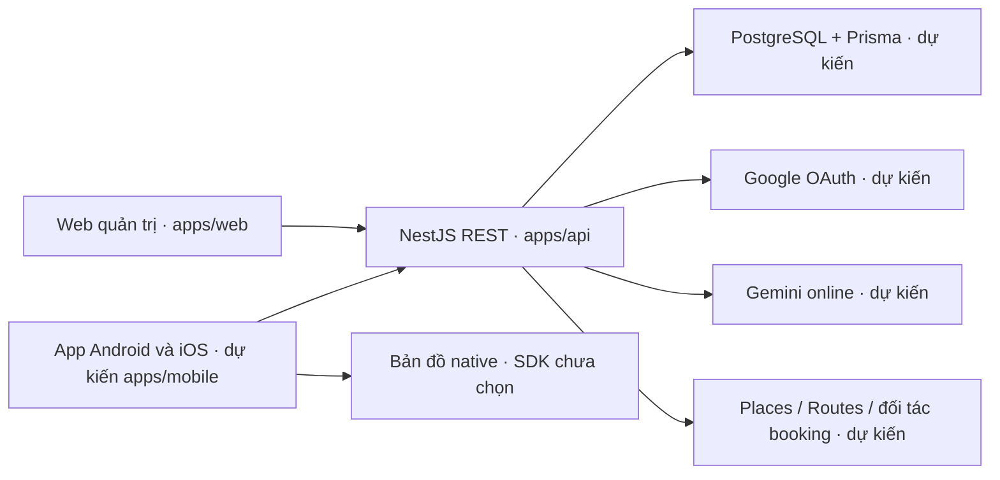

# Kiến trúc nền và hướng phát triển

## Cấu trúc hiện tại và dự kiến

Sau [PR #12](https://github.com/nyanduong/go-ease-webapp/pull/12), pnpm workspace có `apps/web`, `apps/api`, `packages/contracts` và kiểm thử. **Chưa có `apps/mobile`, DB/auth/nghiệp vụ/admin shell hoặc adapter dịch vụ ngoài.** Sơ đồ dưới mô tả hướng phát triển đã chốt ngày 09/10/2026, không phải bằng chứng các tích hợp đã chạy:



App khách Android và iOS phát triển **song song ngay từ đầu** bằng **một codebase React Native + TypeScript + Expo**, nghiệm thu bằng development build. Ưu tiên thư viện hỗ trợ cả hai, kiểm chứng tương thích trước khi chọn ở #15/#8; chỉ tách phần đặc thù khi cần, không làm xong Android rồi mới iOS. `apps/web` giữ React + Vite + TypeScript, Tailwind + shadcn/ui cho quản trị/vận hành. Chia sẻ API contracts/logic phù hợp, không hứa chung toàn bộ UI. Không đổi tên repo hoặc di chuyển `apps/web`.

## Phần đang chạy từ GE-M0-01

`apps/web` là React/Vite SPA: pages bố trí màn hình, components hiển thị, lib chứa fetch và tiện ích. Tailwind v4 dùng Vite plugin; Button từ shadcn/ui Radix new-york được điều chỉnh token GoEase. Màn kết nối không cần dịch vụ ngoài, là màn kỹ thuật chưa phải prototype/nhận diện cuối được leader duyệt; shell admin sẽ làm theo phần prototype đã duyệt ở #14/#16.

`apps/api` là NestJS ESM trên Node 24, một backend REST chia theo chức năng, prefix `/api`, hiện có health controller. Bootstrap ConfigModule đọc `.env`/runtime và validate lúc khởi động; production bắt buộc WEB_ORIGINS hợp lệ. `createApp` nhận cấu hình explicit đã validate trong test, bỏ qua env file/runtime cá nhân. Filter chung trả `{ error: { code, message, statusCode }, path, timestamp }`; lỗi nội bộ không lộ stack/query. CORS hiện cho origin cấu hình, methods GET/OPTIONS, không dùng credentials; đây chưa phải thiết kế session/auth native hoặc admin.

`packages/contracts` xuất type/error envelope và runtime guard health dùng ở cả API/web. Phản hồi `GET /api/health`:

```json
{"status":"ok","service":"goease-api","scope":"api-only","timestamp":"2026-10-08T08:00:00.000Z"}
```

Timestamp là thời điểm ISO UTC. Endpoint chỉ chứng minh tiến trình API trả lời, chưa phải readiness DB/AI/Maps. Web có timeout 8 giây, hủy request khi unmount, không tự gọi lại vô hạn; nút thử lại gửi request mới và bỏ success cũ khi thất bại. Timestamp hiển thị theo Asia/Ho_Chi_Minh.

`pnpm dev` build contracts trước rồi watch contracts/API/web; compiler lỗi giữ dist hợp lệ và phục hồi khi sửa. API dev dùng TypeScript watcher + Node watcher, web dùng Vite. Lệnh chạy riêng `dev:api`/`dev:web` cần contracts build hoặc watcher riêng; xem [README](../README.md), không chạy nhiều watcher contracts đồng thời.

Test hiện có: API/config và subprocess regression cô lập env, UI fetch doubles, smoke web production–API thật, dev fixture kiểm tra contracts/recovery/process cleanup. Chromium mobile là viewport web, không kiểm chứng native. Root typecheck/lint/test/build được chạy tuần tự trong **Quality Gate**; CI của PR mới phải kiểm chứng trên HEAD mới.

API local chỉ lắng nghe `127.0.0.1`; địa chỉ này trên điện thoại là điện thoại, chưa phải laptop. Bind/network trên thiết bị theo #15; public hosting/HTTPS/rollback theo #10. Localhost không được gọi là staging.

## Ranh giới sẽ triển khai theo issue

- **Dữ liệu và quyền:** PostgreSQL + Prisma chỉ API truy cập. Thiết kế dữ liệu/ma trận quyền ở [#2](https://github.com/nyanduong/go-ease-webapp/issues/2) được leader review trước migration [#3](https://github.com/nyanduong/go-ease-webapp/issues/3); chưa tạo schema hoặc thiết kế mọi bảng ở tài liệu này. Dữ liệu chuyến riêng tách khỏi danh mục tham chiếu admin quản lý. Backend xác minh danh tính/owner và cấp admin, không tin userId/ownerId/role từ app/web; biết URL hoặc ẩn menu không cấp/bảo vệ quyền. Admin không mặc nhiên được đọc/sửa mọi chuyến riêng.
- **Google OAuth:** #4 xác minh login/logout/session và quyền server; Android, iOS và web có client types/redirect/deep link phù hợp từng môi trường. Không sao chép giả định cookie/CORS web sang native; mock identity chỉ ở test, chưa phải login live.
- **AI:** Gemini adapter ở backend cho bản online, Ollama chỉ thử nghiệm, không gọi cả hai cho mọi yêu cầu. Dùng dữ liệu kiểm soát, validate input/output có cấu trúc, tính lại ngày/tiền/ràng buộc; người dùng được sửa. Timeout/retry có giới hạn, secret không ra app/web. Model/version/quyền/hạn mức/chi phí kiểm chứng ở #7 lúc triển khai; M0 chỉ spike tích hợp, chưa engine toàn MVP.
- **Maps:** khách xem map native trong app. #8/#15 kiểm chứng SDK/Expo development build trên Android/iOS trước chọn; Maps JavaScript/WebView/browser responsive không chứng minh native. Phân biệt bản đồ nền, dữ liệu Places (New) và tuyến Routes, nơi gọi app/backend được quyết định trong spike; sơ đồ chưa chốt adapter/SDK. Tọa độ/tuyến từ nguồn hợp lệ, không từ LLM bịa; quyền vị trí foreground, denied/revoked/no GPS/network/API/no route phải rõ. Tách key app Android/iOS và server, hạn chế/attribution/terms theo kết quả kiểm chứng.
- **Booking và staging:** đối tác khách sạn/vé máy bay vẫn thuộc MVP; #9 phân biệt quyền API/hợp đồng, sandbox, chuyển đối tác, yêu cầu và xác nhận, chưa giả định tồn chỗ/booking thật. #10 dùng HTTPS admin/API và DB riêng phía backend, bản thử Android/iPhone thật được ký/cài qua đường được phép; không tự tạo tài nguyên trả phí hoặc phát hành store.

MVP tại Việt Nam, một điểm đến chưa chốt, chuyến 1–5 ngày, ngân sách tổng nhóm VND và trải nghiệm địa phương. M0 kiểm chứng nền/tích hợp, chưa full AI/booking/admin suite; chưa turn-by-turn/giọng nói/vị trí nền/offline, tự vận hành vé/hoàn tiền, training AI, microservices hay hệ thống nhiều agent.

## Kiểm chứng và bàn giao

Android/iOS đã quyết định song song; tài khoản/quyền/toolchain/build/ký/cài/phân phối và thiết bị mỗi nền tảng chưa xác minh. #15 kiểm tra cả hai ngay khi dựng nền; prototype/OAuth/Gemini/Maps/staging/booking theo [bảng điều kiện](WORKFLOW.md#điều-kiện-cần-xác-minh). Kết quả riêng từng nền tảng dùng [mẫu nghiệm thu](WORKFLOW.md#mẫu-nghiệm-thu), phân biệt máy thật/emulator/simulator, Expo Go/development build và mock/sandbox/live; thiếu chỉ chặn phần tương ứng, không loại iOS hoặc tự báo đạt. Không cần key/thiết bị cho PR tài liệu.

Theo [WORKFLOW](WORKFLOW.md): issue → branch → triển khai → test/CI → PR → nyanduong kiểm tra/quyết định merge cả PR của mình. Required approvals = **0**, collaborator review khuyến khích/tự nguyện; “Chờ kiểm tra” là chờ leader. PR/Quality Gate/resolve trao đổi và bảo vệ main vẫn bắt buộc. Codex chỉ merge khi có yêu cầu rõ ràng riêng; leader vẫn duyệt nội dung/prototype, agent không tự duyệt sản phẩm.
