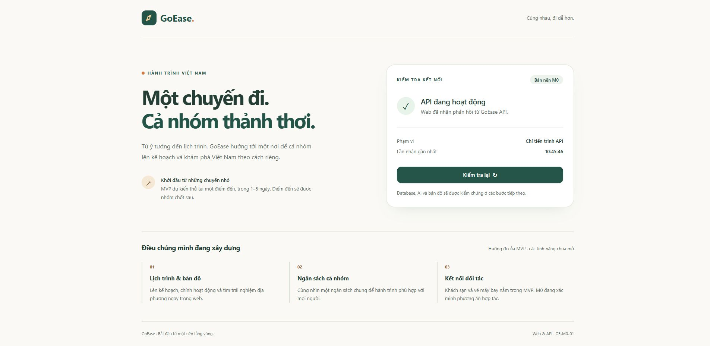
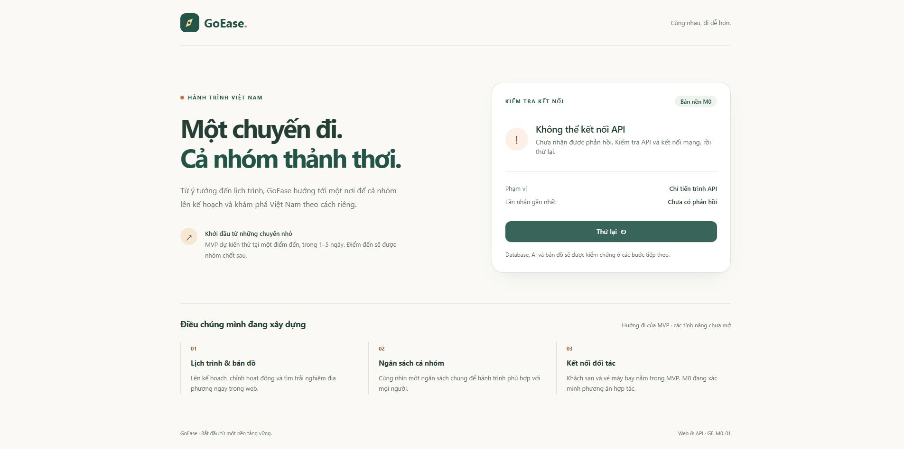

# Kiểm chứng GE-M0-01 — 08/10/2026

Checkout: branch `chore/issue-1-project-bootstrap`, nền từ origin/main. Môi trường local Windows, Node 24.15.0, pnpm 10.34.6. Kết quả CI và review hiện tại xem trực tiếp tại PR liên kết issue #1; báo cáo này ghi kiểm chứng local, không thay thế CI.

| Kiểm tra | Kết quả |
| --- | --- |
| pnpm install --frozen-lockfile | Đạt, lockfile không đổi |
| pnpm typecheck | Đạt: contracts, API, web và smoke config/test |
| pnpm lint | Đạt, 0 warning |
| pnpm test | 14/14 đạt, 0 fail/skip/cancel: 6 API/config, 6 UI, 2 smoke |
| pnpm build | Đạt cả contracts/API/web |
| pnpm dev:api + pnpm dev:web | Khởi động được từ root bằng PowerShell |
| pnpm dev | Khởi động cùng web/API từ root; cả hai trả HTTP 200 |

## Thử tự động

API test khởi động Nest thật và dùng HTTP trên port ngẫu nhiên: health 200, contract/timestamp, route 404 với error envelope, bỏ query và stack, CORS allowed/denied. Test cấu hình từ chối mode/port/origin sai và yêu cầu origin rõ ràng ở production.

UI unit test dùng **fetch doubles**: loading/khóa nút, success, API lỗi/thử lại phục hồi, HTTP lỗi, contract sai, JSON sai và abort khi unmount. Không coi các test này là tích hợp live.

Playwright smoke khởi động **web production và API thật** trên 4173/3020, chạy Chromium desktop và Pixel 7 viewport: health network 200, nút kiểm tra gửi request mới, không lỗi console/pageerror, không tràn ngang. Không có DB/OAuth/AI/Maps/booking trong test này.

## Thử trực tiếp bằng Chrome

- Desktop viewport thực tế 1920px, mobile override 390 × 844. Kiểm tra ảnh toàn trang, nội dung/nút đọc được, không tràn ngang (scrollWidth 1905/375 tương ứng).
- Web 127.0.0.1:5173 gọi API 127.0.0.1:3000/api/health. Network xác nhận 200, JSON và Access-Control-Allow-Origin đúng origin web; không lấy success từ mock/cache.
- Dừng API thật bằng Ctrl+C trong terminal; xác minh cổng không còn trả lời. Bấm nút trên mobile rồi desktop: hiện “Không thể kết nối API”, bỏ thời điểm success cũ, có “Thử lại”. Network ghi net::ERR_CONNECTION_REFUSED như mong đợi.
- Khởi động lại API. Thử lại desktop với độ trễ mạng tạm 1,5 giây: loading hiển thị và nút bị khóa; sau đó health success. Mobile gửi request mới cũng success. Đã xóa độ trễ và reset viewport.
- Console warn/error trống trong kiểm tra trực tiếp; network failure khi tắt API là kết quả mong đợi, không bị diễn giải là pass của kết nối.

Ảnh chỉ chứa giao diện local, không có secret/thông tin đăng nhập:

[Ảnh mobile toàn trang](../evidence/ge-m0-01-mobile.jpg)

## Giới hạn

Health xác nhận **API-only**. Chưa kiểm chứng DB, quyền sở hữu, AI, Maps, booking hoặc staging. GE-M0-01 có thể bàn giao review khi CI đạt; điều đó không nghiệm thu toàn bộ M0. Templates/workflow trong branch chưa áp dụng trên main trước merge.
